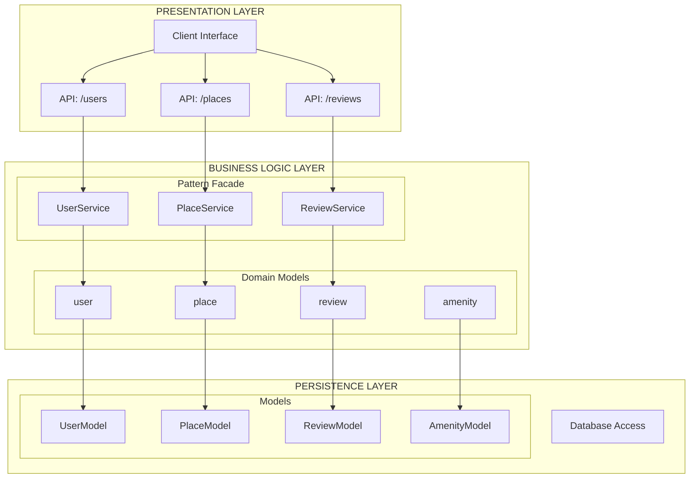

```mermaid

flowchart TD

subgraph Presentation_Layer [PRESENTATION LAYER]
    Interface[Client Interface]
    API_Users[API: /users]
    API_Places[API: /places]
    API_Reviews[API: /reviews]
end

subgraph Business_Logic_Layer [BUSINESS LOGIC LAYER]
    subgraph Facade [Pattern Facade]
        UserService[UserService]
        PlaceService[PlaceService]
        ReviewService[ReviewService]
    end
    subgraph DomainModels [Domain Models]
        UserDomain[user]
        PlaceDomain[place]
        AmenityDomain[amenity]
        ReviewDomain[review]
    end
end

subgraph Persistence_Layer [PERSISTENCE LAYER]
    Database[Database Access]
    subgraph Models [Models]
        UserModel[UserModel]
        PlaceModel[PlaceModel]
        ReviewModel[ReviewModel]
        AmenityModel[AmenityModel]
    end
end

Interface --> API_Users
Interface --> API_Places
Interface --> API_Reviews

API_Users --> UserService
API_Places --> PlaceService
API_Reviews --> ReviewService

UserService --> UserDomain
PlaceService --> PlaceDomain
ReviewService --> ReviewDomain

UserDomain --> UserModel
PlaceDomain --> PlaceModel
ReviewDomain --> ReviewModel
AmenityDomain --> AmenityModel
```

---
