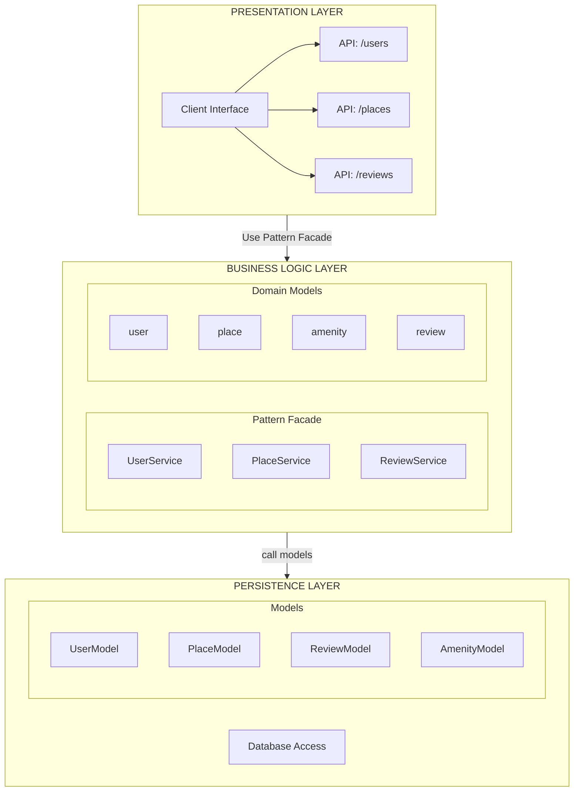

```mermaid

flowchart TD


%% Presentation Layer
subgraph Presentation_Layer [PRESENTATION LAYER]
    Interface[Client Interface]
    API_Users[API: /users]
    API_Places[API: /places]
    API_Reviews[API: /reviews]
end

%% Business Logic Layer
subgraph Business_Logic_Layer [BUSINESS LOGIC LAYER]
    subgraph Facade [Pattern Facade]
        UserService[UserService]
        PlaceService[PlaceService]
        ReviewService[ReviewService]
    end
    subgraph DomainModels [Domain Models]
        UserDomain[user]
        PlaceDomain[place]
        AmenityDomain[amenity]
        ReviewDomain[review]
    end
end

%% Persistence Layer
subgraph Persistence_Layer [PERSISTENCE LAYER]
    Database[Database Access]
    subgraph Models [Models]
        UserModel[UserModel]
        PlaceModel[PlaceModel]
        ReviewModel[ReviewModel]
        AmenityModel[AmenityModel]
    end
end

%% Relations
Interface --> API_Users
Interface --> API_Places
Interface --> API_Reviews

Presentation_Layer --Use Pattern Facade --> Business_Logic_Layer
Business_Logic_Layer --call models--> Persistence_Layer
```

---
