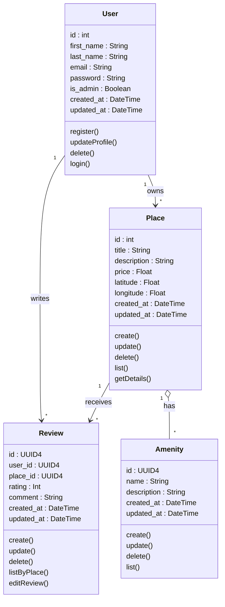

```mermaid
classDiagram

class User {
  id : int
  first_name : String
  last_name : String
  email : String
  password : String
  is_admin : Boolean
  created_at : DateTime
  updated_at : DateTime

  register()
  updateProfile()
  delete()
  login()
}

class Place {
  id : int
  title : String
  description : String
  price : Float
  latitude : Float
  longitude : Float
  created_at : DateTime
  updated_at : DateTime

  create()
  update()
  delete()
  list()
  getDetails()
}

class Review {
  id : UUID4
  user_id : UUID4
  place_id : UUID4
  rating : Int
  comment : String
  created_at : DateTime
  updated_at : DateTime

  create()
  update()
  delete()
  listByPlace()
  editReview()
}

class Amenity {
  id : UUID4
  name : String
  description : String
  created_at : DateTime
  updated_at : DateTime

  create()
  update()
  delete()
  list()
}

User "1" --> "*" Review : writes
User "1" --> "*" Place : owns
Place "1" --> "*" Review : receives
Place "1" o-- "*" Amenity : has
```

---
